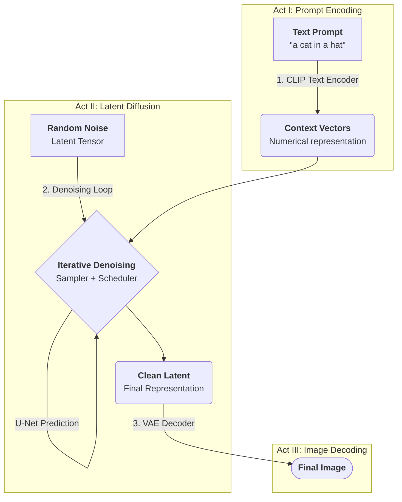

# 🧠 Understanding Stable Diffusion: Core Models & Techniques

Welcome! This repository provides clean, well-commented, and self-contained PyTorch implementations of the core neural network architectures and techniques used in modern latent diffusion models like **Stable Diffusion**.

The goal is to offer a clear, educational resource for engineers, researchers, and students to understand these powerful generative systems from first principles, free from the complexity of production-level frameworks.

**No installation or setup is required**—this is a code-as-documentation project designed for reading and learning.

## 🗺️ System Overview: The Generative Process

The text-to-image synthesis process is a deterministic, multi-stage pipeline involving several key components.

## 🛠️ Core Components & Techniques

This project is broken down into self-contained scripts, each detailing a fundamental component or technique.

### Core Models
1.  **The U-Net (`unet.py`):** The central noise prediction model. It uses a convolutional backbone with attention layers to process image latents.
2.  **The VAE (`vae.py`):** The image compressor/decompressor for the latent space.
3.  **The CLIP Text Encoder (`clip_encoder.py`):** The model that understands the text prompt.
4.  **The DiT Model (`dit_model.py`):** An alternative, transformer-only backbone (like in SD3) that replaces the U-Net.

### The Denoising Process
5.  **Schedulers (`schedulers.py`):** Functions that create the sequence of noise levels (`sigmas`) for the denoising process. This defines the "path" from a noisy image to a clean one.
6.  **Samplers (`k_diffusion_samplers.py`):** The iterative algorithms (like Euler, DPM++) that "walk" along the path defined by the scheduler, using the U-Net's prediction at each step.
7.  **CFG Sampler (`cfg_sampler.py`):** A high-level script showing the logic of the sampling loop, including Classifier-Free Guidance (CFG), which is crucial for high-quality output.

### Customization & Control
8.  **ControlNet (`controlnet.py`):** An architectural addition that allows for precise spatial conditioning of the U-Net, using inputs like edge maps or human poses.
9.  **LoRA (`lora.py`):** An efficient technique to fine-tune the model's *style*.
10. **Textual Inversion (`textual_inversion.py`):** A method to teach the model a new *visual concept* or noun.

---
### Comparison of Customization & Control Techniques

| Feature | **Textual Inversion** 💡 | **LoRA** 🎨 | **ControlNet** 📐 |
| :--- | :--- | :--- | :--- |
| **Primary Goal** | Teach a new **concept/noun**. | Adapt the **style/behavior**. | Impose **spatial structure/layout**. |
| **What it Modifies** | The **vocabulary** of the Text Encoder. | The **cross-attention layers** of the U-Net. | Adds new **parallel blocks** to the U-Net. |
| **What is Trained?** | A single new word embedding vector. | Small "low-rank" matrices inside the U-Net. | The copied blocks and "zero-conv" layers. |
| **Primary Input** | 5-10 images of the new concept. | A dataset with a consistent style. | An image-like condition map (edges, pose). |
| **Output Size** | Extremely small (KBs). | Very small (2-200 MB). | Large (~1 GB). |

---

## 🚀 How to Explore This Repository

Simply navigate to the Python files. Each is heavily commented to explain its architecture and role. We recommend studying them in the following order:

1.  **Core Models:** `clip_encoder.py` → `vae.py` → `unet.py`
2.  **The Denoising Process:** `schedulers.py` → `k_diffusion_samplers.py` → `cfg_sampler.py`
3.  **Alternative Backbone:** `dit_model.py`
4.  **Customization/Control:** `textual_inversion.py` → `lora.py` → `controlnet.py`
